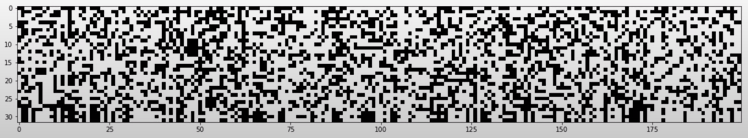

# Activation function

Alcune delle più note funzioni di attivazione:


Queste funzioni "schiacciano" i valori in uscita, es. **tanh()** schiaccia i valori, portandoli verso -1 e +1.

L'effetto della funzione di attivazione influenza il vettore **H** all'interno degli **hidden layer**.  
Quando nel **passaggio in avanti** calcoliamo h, abbiamo:
```py
# ciclo..
    # forward pass the neural net
        emb = self.C[torch.tensor([context])] # (1,block_size,dim_embedding_vector)
        preact = emb.view(1, -1) @ W1 + b1
        h = torch.tanh(preact) 

# immaginiamo che h.shape = torch.Size([32, 200]), cioè che ci siano 32 righe di attivazione, 
# che passano attraverso 200 neuroni.

# trasformiamo h in un vettore unico:
h.view(-1).shape # torch.Size([5400])

# convertiamolo in una lista python:
h.view(-1).tolist()

#e plottiamola in istogramma:
plt.hist(h.view(-1).tolist(), 50)
plt.show()
```


Si vede l'effetto di schiacciamento di **tanh()**. Molti valori valgono -1 e +1 e pochissimi sono nel mezzo.  
Questo perché i valori dati in input alla tanh(),sono nel vettore **preact**, che ha una forma del tipo:
```py
plt.hist(preact, 50)
plt.show()
```


che è molto larga, va da [-20, +20] e quindi produrrà molti valori -1, +1 eseguendo tanh()

Ricordiamo che, durante la backpropagation, il calcolo del gradiente di tanh è:  
```py
def tanh(self):
    t = (math.exp(2*x) - 1)/(math.exp(2*x) + 1)
    def backward():
        self.grad += (1- t**2)* out.grad
```
quando, per esempio, t = 1 , abbiamo che t\**2 = 1,  
di conseguenza 1 - 1 = 0 sarà il moltiplicatore di out.grad, che **"ammazzerà" il gradiente** e fermerà la backpropagation!  
Quando t = 0, avremo t**2 = 0, (1-0) = 1 che fa da moltiplicatore e quindi permette, semplicemente, ad out.grad
di **attraversare il neurone senza elaborazioni**. Difatti in questo caso, tanh() è inattiva.  
Più si è nei pressi delle code del tanh(), più il risultato viene schiacciato verso -1, +1 e i gradienti vengono distrutti.

Possiamo esaminare **h** per graficarne i valori assoluti, per vedere quanto spesso h si trova in una regione piatta di tanh().  
Otterremo un tensore booleano

```py
boolean_tensor = h.abs() > 0.99

plt.figure(figsize=(20, 10))
plt.imshow(boolean_tensor, cmap="gray", interpolation="nearest")
```
avremo 32 righe, i samples di input, e 200 colonne, cioè i neuroni.
i punti bianchi indicano valore VERO, i neri FALSO.



le zone bianche indicano neuroni molto attivi, che spiaccicano le uscite verso -1, +1, ammazzando i gradienti durante la backpropagation.  
Se un'ìntera colonna è bianca, si dice che siamo in presenza di un **dead neuron**, in quanto nessun possibile input, riesce ad attivare il neurone,
che quindi ferma ogni possibile gradiente, durante la backpropagation.  

#### Dead Neuron
E' assimilabile ad una specie di danno cerebrale permanente.  
Un dead neuron non si attiva mai, per ogni possibile dato in input.  
Il suo gradiente è sempre 0, difatti, **non riesce ad imparare niente**, perché ferma ogni possibile gradiente.  
Ogni tipo di funzione di attivazione che "schiaccia l'output", può far sì che si presenti il problema dei neuroni morti.  
Il problema può presentarsi sia quando la combinazione dei pesi e bias in input provocano un dead neuron per ogni iterazione futura,
sia durante le ottimizzazioni.  
Ad esempio con **learning rates troppo alti**, si potrebbero formare gradienti eccessivi che vengono eliminati dalla 
varietà dei dati.  

https://www.linkedin.com/advice/3/how-do-you-debug-dead-neurons-neural-network-gqxxc#what-are-dead-neurons?


