# Gradients and Backpropagation

### Gradiente  
Il gradiente misura l'entità dell'effetto della funzione su una data variabile, considerando le altre variabili della stessa come costanti.  
Se consideriamo la variabile **x**, vogliamo capire come essa viene modificata quando passa attraverso la f(x) che produrrà un certo output, in quanto sarà presente
una componente **output_x** che fa parte dell'output della f(x).  
**output_x** sarà creato da **x** moltiplicato per un certo valore introdotto dalla **sensibilità di f(x) sulla x**. 

 **output_x = x * x.grad**.  

Esempi  

* se abbiamo una funzione che lascia scorrere la sua variabile x dall'input all'ouput senza condizionamenti:
**x.grad = 1** 

* se abbiamo una funzione che lascia scorrere la sua variabile x dall'input all'ouput riducendola di 1/2:
**x.grad = 0.5**

* se abbiamo una funzione che blocca la sua variabile x in output:
**x.grad = 0**

### Derivata di una f(x) semplice e gradienti.

#### moltiplicazione
Consideriamo una f(x) semplicissima che moltiplica due variabili:  
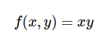  

e le derivate di f(x) rispetto a queste due variabili:  
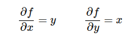  

Se, per esempio, **x=4** e **y =-5**, per cui **f(x, y) = xy = -20**.  
la derivata della f(x) rispetto alla variabile x è **-5**.  
La derivata della f(x) rispetto alla variabile y è **4**.  

Vuol dire che se aumento x di una piccola quantità **h infinitesimale**, la funzione, nella sua interezza, ha l'effetto di diminuire x di 5 volte.
Se, invece, aumento y di una piccola quantità, l'effetto della funzione sarà quello di aumentare y di 4 volte.  
Questo significa che **la derivata su ciascuna variabile indica la sensibilità dell'intera funzione rispetto a quella variabile.**  

Quindi per quei valori di x e y, avremo i seguenti gradienti: **x.grad = -5**, **y.grad=4**.


#### addizione

funzione che somma due variabili:  
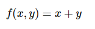  

le derivate di f(x) rispetto a queste due variabili sono:  
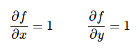  

Se, per esempio, **x=5** e **y =3**, per cui **f(x, y) = x + y = 8**. 
Vuol dire che se aumento x di una quantità h infinitesimale, in output avrò lo stesso valore x aumentato di quella piccola quantità h e poi verrà fatta addizione con y.  
L'effetto della f(x) riguardo a x è quello di lasciarlo scorrere dall'input all'output, senza alcun condizionamento.  
Stessa cosa se considero y.  
Vuol dire che il gradiente x è 1 e il gradiente di y è 1.  

**x.grad = 1**, **y.grad=1**.


#### funzione max

funzione che trova il massimo tra due variabili:  
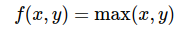  

le derivate di f(x) rispetto a queste due variabili sono:  
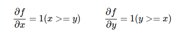 

Se, per esempio, consideriamo **x=4** e **y =2**, per cui **max(x, y) = x = 4**.  
Ora se aumento x di una quantità infinitesimale h, in output avrò la stessa quantità x aumentata della piccola quantità h.  
Se aumento y di una quantità infinitesimale h, in output avrò sempre 4, cioè x, non ci sarà traccia di y!
Vuol dire che per gli input considerati la f(x), nella sua interezza, ha l'effetto di lasciare passare x senza condizionamenti, ma di bloccare y!
Quindi, per i valori x=4 e y=2, abbiamo= **x.grad=1**, **y.grad=0**.

### Espressioni composte ed utilizzo della chain rule

Consideriamo funzioni più complesse, come, ad esempio:

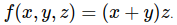 

Questa può essere scomposta nelle più semplici:  
**q = x + y** e **f = qz**

e sappiamo derivarle per poi calcolarne i gradienti:  

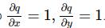   
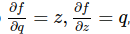  

Tuttavia ci interessa conoscere i gradienti di *f*, rispetto alle variabili *x*, *y*, *z*.  
Fortunatamente la **chain rule** ci assicura che basta moltiplicare la derivate parziali intermedie, per calcolare il valore dei gradienti.  

La derivata parziale di *f(x, y, z)* rispetto a *x* è:  
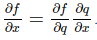 

esempio:  
```py
# set some inputs
x = -2; y = 5; z = -4

# perform the forward pass
q = x + y # q becomes 3
f = q * z # f becomes -12

# perform the backward pass (backpropagation) in reverse order:
# first backprop through f = q * z
dfdz = q # df/dz = q, so gradient on z becomes 3
dfdq = z # df/dq = z, so gradient on q becomes -4
dqdx = 1.0
dqdy = 1.0
# now backprop through q = x + y
dfdx = dfdq * dqdx  # The multiplication here is the chain rule!
dfdy = dfdq * dqdy  
```
### Backpropagation

Sempre per lo stesso esempio, graficamente abbiamo:  
in verde i valori del forward pass, in rosso i gradienti calcolati durante il backward pass applicando la chain rule, a partire dall'output verso gli input (**backpropagation**)

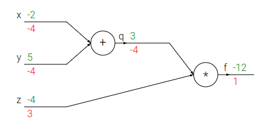 

la **backpropagation** è un processo **locale**, difatti ogni **gate** (porta) della rete prende in ingresso degli input e da questi possiamo calcolare:
* l'**output del gate** (forward pass) 
* il **gradiente locale** del suo output rispetto agli input

Questi calcoli possono essere fatti senza conoscere come è fatto il resto della rete.  
Grazie alla **chain rule**, però è possibile concatenare i calcoli fatti per il singolo nodo, con i calcoli fatti per gli altri nodi,
in quanto il gradiente del singolo nodo va moltiplicato in ogni gradiente calcolato per tutti gli input.

Esempio:  
consideriamo il primo gate che addiziona x = -2 e y = 5:  
output del gate = 3  
gradiente locale  = 1 per entrambi gli input   

Secondo gate che moltiplica q = 3 e z = -4:  
output del gate = -12  
gradiente locale = per z = 3; per q = -4

Applicando la chain rule è chiaro che questi gradienti locali vengono moltiplicati tra di loro e propagati all'indietro.
Difatti al momento siamo in questa situazione:  

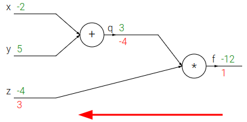 

i gradienti segnati sono definitivi.  
Per calcolare il gradiente definitivo di x e y, applichiamo la chain rule:  
Sappiamo che il gradiente locale di x = 1 e che il gradiente locale di y = 1.  
Quindi:  
**x.grad = 1 * -4 = -4**   
**y.grad = 1 * -4 = -4**

e avremo il grafico di sopra, con tutti i gradienti definitivi segnati.

 

Notiamo che, per ottenere **-12** in output della rete, il gate che fa la moltiplicazione **richiede** 
al suo input q di **ridursi di 4 volte** e richiede al suo input z di **aumentare di 3 volte**.  
A sua volta il gate di addizione, proprio perché conscio che gli è stato richiesto di ridurre il suo output di 4 volte,
richiede ai suoi input di ridursi di 4 volte.

La backpropagation è cioè una **comunicazione** che avviene tra i gate della rete.  
I segnali usati per comunicare sono i gradienti,
che dicono ai gate se essi devono ridurre o aumentare i propri output.


#### Pattern noti di backpropagation

Alcune semplici funzioni hanno effetti ben noti durante la backpropagation:

* **somma**: distribuisce equamente il gradiente ai suoi input, copiandolo  

    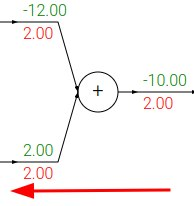 

* **moltiplicazione**: swappa i suoi input e li moltiplica per il gradiente: 

    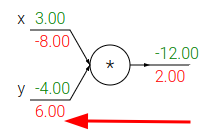 


* **max()**: distribuisce il gradiente, copiandolo, solo al suo input maggiore (**routing**):  

    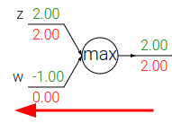 


### Gradienti in operazioni vettoriali
I concetti descritti finora fanno riferimento a variabili scalari, ma il calcolo dei gradienti può essere esteso anche ai tensori.  
Bisogna fare attenzione alla dimensioni delle matrici ed alle operazioni di trasposte di matrici!  

#### moltiplicazione di matrici @

```py
# forward pass

d = a @ b + c
esempio:
d.shape = [32, 27]
a.shape = [32, 64]
b.shape = [64, 27]
c.shape = [27]
```
La derivata **da** avrà la **stessa forma** di a.    
Ricordando la derivata di una moltiplicazione, si vede che
**da = b**, ma b non ha la stessa forma di a!  
Però ragionando con le trasposte, riusciamo a cambiare le forme delle matrici interessate e calcolare le derivate parziali delle 3 variabili coinvolte:  

```py
da = d @ b.T    # [32, 64]
db = a.T @ d    # [64, 27]
dc = a.sum(0)   # [27]
```  

#### moltiplicazione semplice
Moltiplica elemento per elemento corrispondente.  

```py
a = b * c 
con 
a.shape = [32, 64] 
b.shape = [ 1, 64] #bngain
c.shape = [32, 64] #bnraw
```
Come per le altre moltiplicazioni, la derivata **db = c**,
che, però ha una forma [32, 64] che è diversa dalla forma di b [1, 64].  
Per ottenere la stessa forma di b sommiamo con:  

```py
db = c.sum(0, keepdim=True) # [1, 64]
```

dc, invece è semplicemente: **dc = b**, che ha stessa forma [32, 64] di c.   

#### somma per riga 
```py
# forward pass
b = a.sum(1, keepdim=True)
con
a.shape = [3, 3]
b.shape = [3, 1]
```
equivale a: 

a11 a12 a13 ---> b1 (= a11 + a12 + a13)  
a21 a22 a23 ---> b2 (= a21 + a22 + a23)  
a31 a32 a33 ---> b3 (= a31 + a32 + a33)  

b1 dipende solo dai valori a11,a12,a13 della prima riga.  
La derivata di b1 rispetto ai valori a11,a12,a13 è 1 ed è 0 rispetto ai valori delle altre righe.  
Generalizzando per tutti i valori di b, possiamo quindi scrivere:  

```py
# backward pass
db = torch.ones_like(a)
```
i gradienti sono nella matrice **db**, delle stesse dimensioni di **a** e sono tutti pari a 1.

#### sottrazione per riga
```py
# forward pass
c = a - b
c.shape = [3, 3]
a.shape = [3, 3]
b.shape = [3, 1]
```
se vogliamo calcolare **db**, consideriamo che

c11 c12 c13 = a11 a12 a13 - b1   
c21 c22 c23 = a21 a22 a23 - b2  
c31 c32 c33 = a31 a32 a33 - b3  

es.: c32 = a32 - b3  
Cioè la derivata di c32 rispetto ad a32 è **1**.  
La derivata di c32 rispetto a b3 è **-1**.  

viene fatto un broadcast implicito durante la sottrazione, per replicare la colonna di b lungo quelle di a.  

Generalizzando la derivata di b rispetto a c è:

```py
# backward pass
db  = (-c).sum(1, keepdims= True)
```
Si noti la somma dovuta al broadcast implicito fatto durante il forward pass.

#### funzione max()

```py
# forward pass
b = a.max(1, keepdim=True).values
```
in questo caso la funzione **max()**, come già visto per il caso di scalari,
lascia passare SOLO il numero più grande, facendo da router.  

Quindi per il caso di vettori, possiamo pensare che la derivata di **b** rispetto ad **a** è implementabile riga per riga con una codifica **one-hot**, che sarà di valore 1
solo in corrispondenza dell'elemento a è che è il massimo valore di riga.  
```py
# backward pass
b = F.one_hot(a.max(1).indices, num_classes=a.shape[1]) 
```
