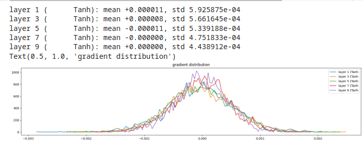
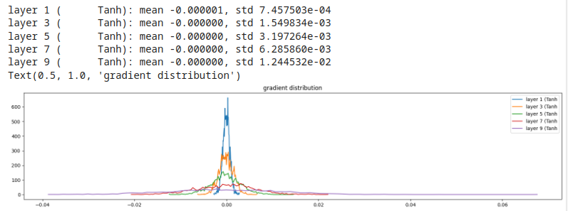
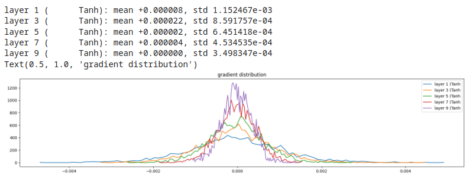

# Backward pass statistics

Esempio  
Ragionando sugli hidden layer, monitoriamo i gradienti delle funzioni di attivazione (tanh()).  
Ci interessa conoscere la **media** e la **deviazione standard**. 

```py
# visualize histograms for backward pass...
plt.figure(figsize=(20, 4)) # width and height of the plot
legends = []
for i, layer in enumerate(layers[:-1]): # note: exclude the output layer
  if isinstance(layer, Tanh):
    t = layer.out.grad
    print('layer %d (%10s): mean %+f, std %e' % (i, layer.__class__.__name__, t.mean(), t.std()))
    hy, hx = torch.histogram(t, density=True)
    plt.plot(hx[:-1].detach(), hy.detach())
    legends.append(f'layer {i} ({layer.__class__.__name__}')
plt.legend(legends)
plt.title('gradient distribution')
```
#### Considerazioni
* esempio 1, gain = 5/3
  

Si nota come tutti i layer producano, grossomodo, gli stessi gradienti, ben distribuiti.

* esempio 2, gain = 0.5 (gain basso)
  

I gradienti tendono ad accumularsi verso lo zero! **Comportamento da evitare!**

* esempio 3, gain = 3 (gain alto)
  

gradienti asimmetrici, soprattutto nei layer più interni, **Comportamento da evitare!**