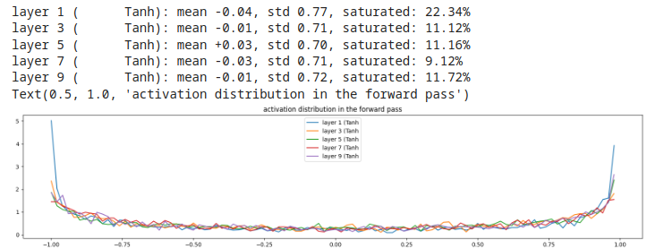
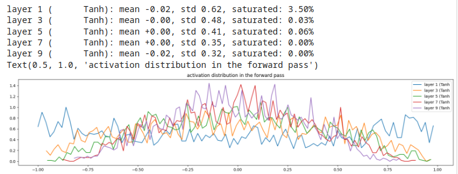
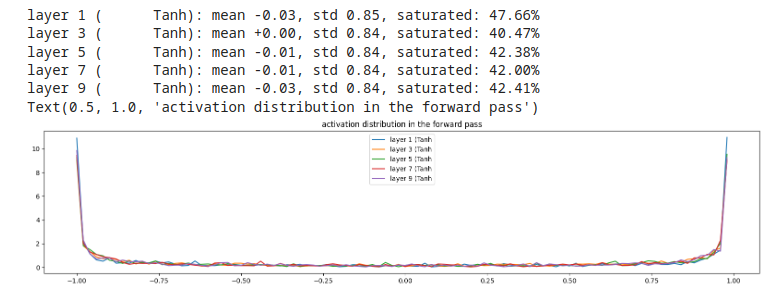

# Forward pass statistics

Esempio  
Ragionando sugli hidden layer, monitoriamo gli output delle funzioni di attivazione (tanh()).  
Sappiamo che **tanh()** produrrà output nell'intervallo [-1, +1]  
Ci interessa conoscere la **media**, la **deviazione standard** e la **percentuale di saturazione**.  
Ricordiamo che **quando tanh() è in saturazione ferma la propagazione del gradiente nel processo di backward**.
```py
# visualize histograms for forward pass...
plt.figure(figsize=(20, 4)) # width and height of the plot
legends = []
for i, layer in enumerate(layers[:-1]): # note: exclude the output layer
  if isinstance(layer, Tanh):
    t = layer.out
    print('layer %d (%10s): mean %+.2f, std %.2f, saturated: %.2f%%' % (i, layer.__class__.__name__, t.mean(), t.std(), (t.abs() > 0.97).float().mean()*100))
    hy, hx = torch.histogram(t, density=True)
    plt.plot(hx[:-1].detach(), hy.detach())
    legends.append(f'layer {i} ({layer.__class__.__name__}')
plt.legend(legends);
plt.title('activation distribution in the forward pass')
```
### Considerazioni
#### Esempio 1, gain = 5/3
  

Si nota l'alta saturazione del layer1, poi gli altri layer più interni vanno leggermente stabilizzandosi.   


#### Esempio 2, gain = 1 (no gain)
  

I layer tendono a restringere l'output verso lo zero, **comportamento da evitare!**, è necessario un certo gain per mitigare tale effetto !  

#### Esempio 3, gain = 3 (gain molto alto!)
  

Alta saturazione per tutti i layer! **comportamento da evitare!**