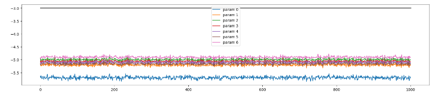
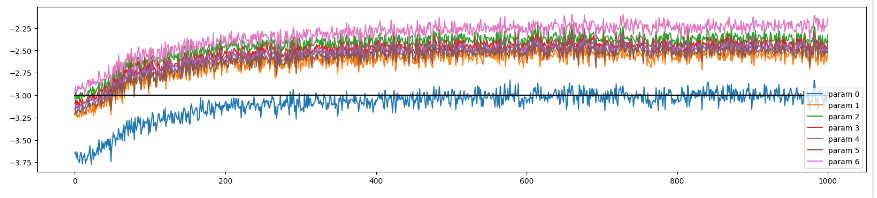

# Update to data-ratio statistics

Può essere utile conoscere **quanto sono grandi** gli update dei valori dei parametri durante il training.  
Il **gradient to data ratio**, usato per comparare la scala dei gradienti, in confronto alla scala dei valori nei neuroni,
non è troppo utile, lo è di più l'**update to data ratio** perché è effettivamente l'entità che indica di quanto modifichiamo i valori nei neuroni.  

Memorizziamo in un array queste entità:  
durante il training della rete, ad ogni iterazione, prendiamo **learning_rate * p.grad** che è il valore effettivo che andiamo ad aggiungere a p.data (**p.data += -learning_rate * p.grad**), 
e dividiamo questo valore per p.data totale (il valore effettivo di p.data al momento dell'iterazione), in modo da ottenerne il **valore di variazione** di p.data.  
Per comodità lavoriamo con **std()** ed effettuiamo i ragionamenti su **scala logaritmica log10()**, graficando in un intervallo ragionevole.  
Si sceglie un intervallo di [-3, 3] di magnitudo, che indica una variazione di p.data, durante l'update non più grande di 1000 volte il valore attuale d p.data.   

```py
ud = []
# running!
for i in range(max_steps):

  # minibatch construct

  # forward pass

  # backward pass

  # update
  lr = 0.1 if i < 150000 else 0.01 # step learning rate decay
  for p in parameters:
    p.data += -learning_rate * p.grad

  # track stats
  with torch.no_grad():
    ud.append([((learning_rate * p.grad).std() / p.data.std()).log10().item() for p in parameters])
```  


per ottenere il grafico di **ud**, per vedere l'evoluzione degli update nel tempo, facciamo:  
```py
plt.figure(figsize=(20, 4))
legends = []
for i,p in enumerate(parameters):
  if p.ndim == 2:
    plt.plot([ud[j][i] for j in range(len(ud))])
    legends.append('param %d' % i)
plt.plot([0, len(ud)], [-3, -3], 'k') # these ratios should be ~1e-3, indicate on plot
plt.legend(legends)
```
Bisogna assicurarsi che i valori vadano stabilizzandosi nel tempo e che non siano **troppo al di sopra** del riferimento a **-3**;
è importante anche che i grafici dei vari layer siano simili.

* esempio 1, learning_rate = 0.001 (lr basso)
  
Un grafico al di sotto di -3 indica che i parametri si stanno allenando lentamente, valore del learning rate basso, frena l'apprendimento della rete!  
Nell'esempio si vedono update di 10.000 volte inferiori ai valori contenuti dentro p.data, le varazioni di p.data sono irrisorie.


* esempio 2, learning_rate = 0.01 (lr corretto)
  
I valori sono tra -3 e -2.5, che è un intervallo accettabile.


#### Considerazioni  

