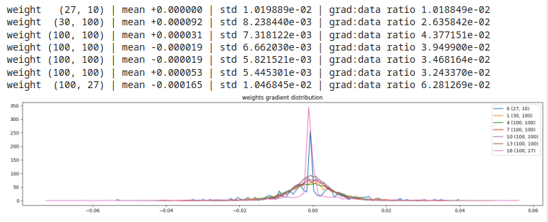

# Weights distribution statistics

E' utile monitorare anche le distribuzioni dei **parametri** della rete.  

Ci concentriamo **sui gradienti dei pesi**, calcolati durante il processo di backpropagation.  
Si potrebbero esaminare anche tutti gli altri parametri, bias, gamma etc., ma per semplicità ci soffermiamo
solo sui pesi dei layer della rete.  

Consideramo la **media**, **deviazione standard** e il **gradient to data ratio**, usato per comparare la scala dei gradienti in confronto alla scala dei valori nei neuroni.  
Quest'ultimo valore è importante da considerare quando usiamo uno **step update** per l'aggiornamento del **learning rate**.  
Sono da evitare valori di **gradient to data ratio** molto alti.

```py
# visualize histograms for the parameters (consider weights only! For simplicity..)
plt.figure(figsize=(20, 4)) # width and height of the plot
legends = []
for i,p in enumerate(parameters):
  t = p.grad
  if p.ndim == 2:
    print('weight %10s | mean %+f | std %e | grad:data ratio %e' % (tuple(p.shape), t.mean(), t.std(), t.std() / p.std()))
    hy, hx = torch.histogram(t, density=True)
    plt.plot(hx[:-1].detach(), hy.detach())
    legends.append(f'{i} {tuple(p.shape)}')
plt.legend(legends)
plt.title('weights gradient distribution');
```

* esempio 1, gain = 5/3 (gain alto)
 

Si notano bassi valori del gradient to data ratio e forma degli output sostanzialmente corretta. Per l'esame grafico valgono le stesse considerazioni viste sui 
grafici dei gradienti, (valori verso lo 0, disallineamento tra i layer etc.)  
Si nota anche, però, che la deviazione standard dell'ultimo layer è in ordine di grandezza 10 volte più alta delle altre deviazioni standard.  
Vuol dire che allenare l'ultimo layer è **10 volte più veloce** che allenare gli altri, questo è problematico e la discesa del gradiente non 
riesce a risolvere del tutto questo difetto. Serviranno ottimizzazioni differenti (**ADAM**) etc. 