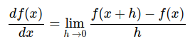

# Maths

## Definizioni

#### Espressione matematica
Un'espressione matematica è un insieme di numeri legati da segni di operazioni matematiche, detti operatori matematici.

#### Funzione lineare
Funzione definita mediante **polinomio di primo grado** f(x) = xa +b, il cui grafico è una retta.  

#### Funzione non lineare
Funzione definita mediante **polinomio di grado superiore al primo**, il cui grafico non è rappresentabile con una retta.

#### Derivata di una funzione *f'(x)*  
   
Rappresenta il tasso di incremento/decremento di una funzione *f(x)* rispetto ad una variabile *x*; misura, cioè, di quanto cambia il valore della funzione al variare di un suo argomento *x*.  Per effettuare tale misura si considera una variazione *h* molto piccola, **infinitesimale**.  

Si dice anche che la derivata misura la crescita/decrescita che avrebbe *f(x)* in uno specifico punto, spostandosi di pochissimo rispetto al punto considerato, o, se vogliamo,
misura la sensibilità di f(x) rispetto al variare di una sua variabile.  
* La *f'(x)* di una funzione *f(x)* nel punto x0 corrisponde alla pendenza della retta tangente al grafico di f(x) nel punto x0.

* Se *f'(x)* esiste per ogni punto x della *f(x)* essa è, di fatto, una funzione che associa a ogni punto di *f(x)* proprio la derivata in quel punto.  
Se *f'(x)* esiste per ogni punto x della *f(x)*, quest'ultima è detta **funzione derivabile**

#### Derivata parziale di una funzione
si applica alle funzioni di più variabili.  
La derivata parziale in un punto rispetto alla prima variabile di *f(x,y)* rappresenta la pendenza della retta tangente alla curva di *f(x,y)*
ottenuta intersecando il grafico di *f* con un piano passante per il punto considerato e parallelo al piano y = 0.  
La derivata parziale di una *f* rispetto ad una variabile x, in un dato punto, si calcola derivando la *f* nella sola variabile x e lasciando tutte le altre sue variabili come costanti.

#### Gradiente di una funzione
Vettore che ha come componenti le derivate parziali della funzione.

#### Differenziazione automatica (Automatic Differentiation) 
calcolo automatico delle derivate di una funzione fatto attraverso operazioni aritmetiche e funzioni elementari (esponenziale, trigonometriche etc.)   

Vedi anche [Differenziazione automatica][diff]

[diff]: https://it.wikipedia.org/wiki/Differenziazione_automatica

#### Funzione composta 
applicazione di una funzione al risultato di un'altra funzione

#### Regola della catena o Chain Rule 
Regola che permette di calcolare la derivata della **funzione composta** di due funzioni derivabili.  
La derivata della funzione composta è il prodotto tra la derivata della funzione esterna, avente come argomento la funzione interna, per la derivata della funzione interna.  
La formula è valida anche per funzioni di più variabili reali e per funzioni vettoriali.  

La regola della catena permette di scomporre una derivata in una serie di derivate più semplici.
