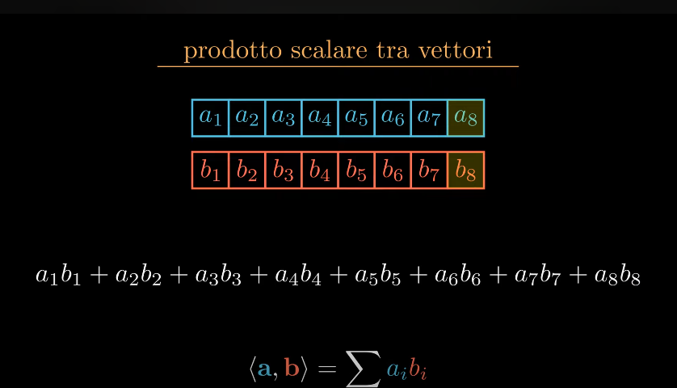
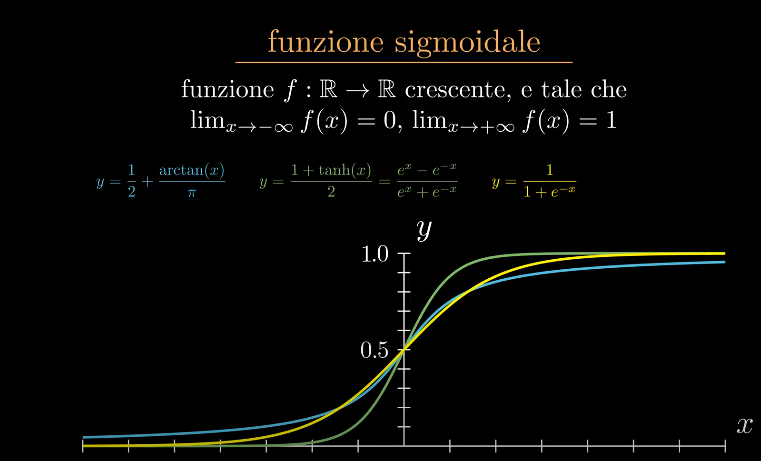
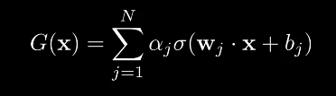
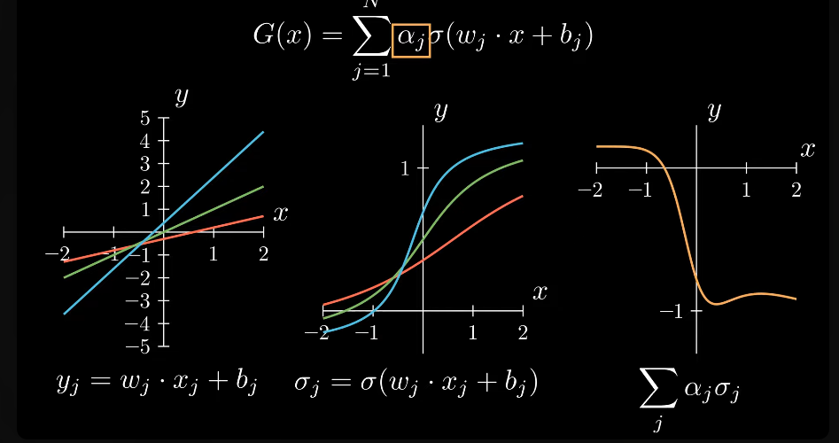
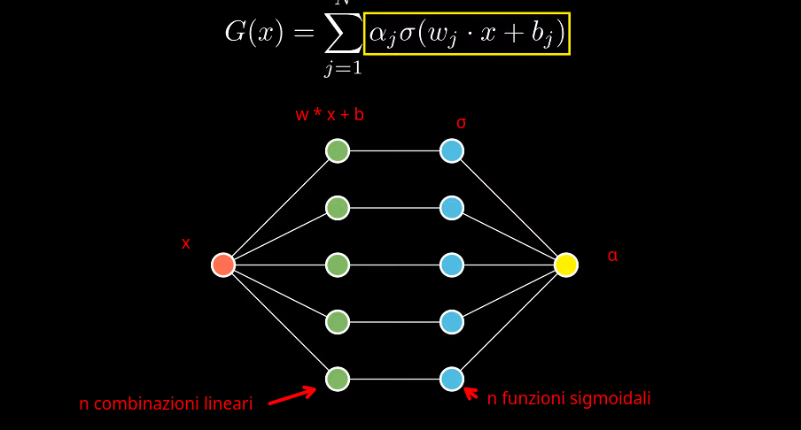
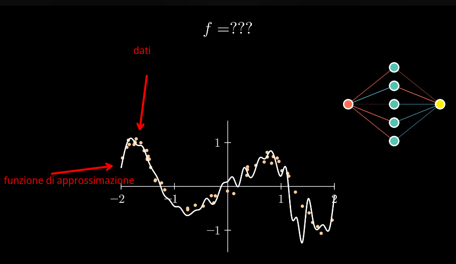
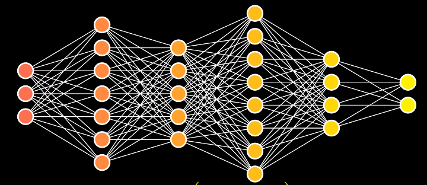

# Neural Networks

Per arrivare alla definizione di rete neurale partiamo dalla definizione di alcuni concetti teorici fondamentali.  

## Prodotto scalare tra vettori (dot product)

Se abbiamo 2 vettori a e b per effettuare il prodotto scalare vengono moltiplicati gli elementi corrispondenti dei due vettori e poi vengono
sommati tutti i prodotti calcolati.  

## Funzione sigmoidale (funzione di attivazione)
Una generica funzione di numeri reali che ha forma di "esse". 
E' cioè una funzione crescente che ha limiti a -∞ = 0 e a +∞ =1  
Esempi sono l'arctan, tangente iperbolica, funzione di Heaviside etc etc

## Teorema di approssimazione universale

Se noi ipotizziamo di avere un **vettore x**  di valori compresi nel range [0, 1] e una **funzione sigmoidale σ continua**, possiamo dire che 
tutte le funzioni somma nella forma:

sono **dense** nello spazio dei numeri reali C[0, 1].  
Questo significa che **una funzione continua si spuò approssimare con funzioni fatte come la G(x) del presente teorema**.

l'argomento (w * x + b) è una retta di pendenza w traslata di quantità pari a b.  
la funzione sigmoidale σ applicata alla retta precedente produce un insieme di valori σ * (w * x + b)  
di cui viene poi calcolata una combinazione lineare α che rappresenta appunto la sommatoria delle varie componenti della funzione.  

é possibile anche rappresentare il tutto graficamente in forma di rete:  
la **variabile x** è l'ingresso della rete  
le **n combinazioni lineari** della sommatoria vengono rappresentate da n nodi interni  
la **σ** è applicata poi ad ogni combinazione lineare
il **valore di output** è dato dalla combinazione lineare **α** dei valori dei nodi  

### Rete neurale
Un certo fenomeno può essere descritto da una funzione che non conosciamo.  
Questa funzione può essere rappresentata da una rete neurale, in accordo con il teorema di approssimazione universale.  
Raccogliamo dei dati che ci forniscono alcuni **campioni** , cioè coppie (x, y) che sono il risultato 
di tale di questa funzione sconosciuta. Alcune coppie possono anche essere approssimate o comunque soggette ad errori strumentali.  
Avendo tali dati a disposizione si calcolano **i parametri delle rete (pesi)** e della combinazione lineare **G(x)** che minimizzano l'errore commesso
dalla rete, approssimando la funzione sconosciuta. Questa è detta **fase di training** della rete.

Per esigenze pratiche, siccome lo strato interno può diventare enorme, è più efficente scomporlo in diversi layer interni. **rete neurale profonda**.  

Oggi si usano funzioni di attivazione anche diverse dalle classiche sigmoidali, es.: GeLU, ReLU etc
