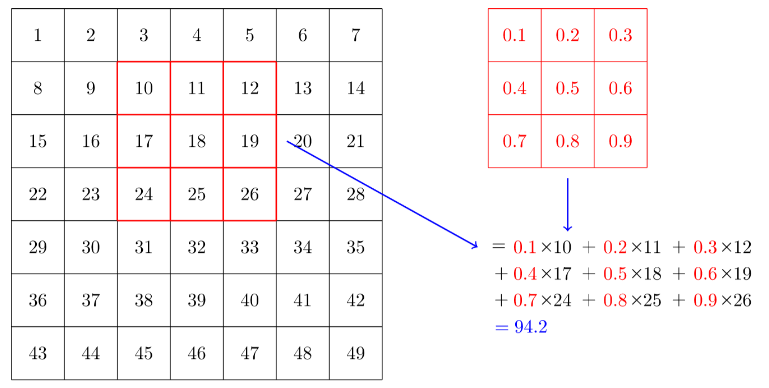

# Convolution

La convoluzione è una tecnica usata soprattutto in **computer vision**.  
Prevede dati di input, moltiplicazioni ed addizioni molto simili alle moltiplicazione di matrici già viste, ed è quindi molto simile ad una rete neurale, come quelle già viste. 

Sappiamo che un'immagine può essere rappresentata, per esempio, con una matrice di rank 2, contenente numeri che rappresentano i pixel con associata informazione del colore.  

Se consideriamo una piccola matrice (es.: 3 x 3), detta **kernel**, di rank 2, e la applichiamo sulla matrice dell'immagine, facendola **scorrere** attraverso l'immagine, ad esempio orizzontalmente, possiamo effettuare un prodotto scalare (**DOT product**) tra queste due matrici.  

L'**operazione di convoluzione** esegue un prodotto scalare tra una porzione 3x3 della matrice-immagine ed il kernel ivi sovrapposto.  



Considerando le immagini del db **MNIST**, che contiene immagini di caratteri numerici scritti a mano, possiamo applicare dei kernel e crearne la convoluzione, per riconoscere i tratti caratteristici (linee, angoli) nelle immagini-carattere, procedendo per tipologia di tratto.  

Possiamo far scorrere un kernel del tipo:
```py
horiz_edge = tensor([ [-1,-1,-1],
                                [ 0, 0, 0],
                                [ 1, 1, 1]]).float()
```
In questo modo il kernel agisce da filtro per le linee orizzontali dell'immagine-carattere, facendole emergere quando l'operazione di convoluzione dà il risultato del prodotto scalare più alto (**attivazione**), durante lo scorrimento del kernel.  
Quando lo scorrimento sarà completato coprendo l'intera immagine, avremo una **mappa di attivazione** per rilevare le linee orizzontali.  

Possiamo creare un nuovo kernel per filtrare le linee verticali:
```py
vert_edge = tensor([  [ 1, 0, -1],
                                [ 1, 0, -1],
                                [ 1, 0, -1]]).float()
```
che le farà emergere sempre facendolo scorrere orizzontalmente. Si possono creare anche altri kernel per filtrare gli angoli etc.  

## Padding e Stride

Se vogliamo che la mappa di attivazione abbia le stesse dimensioni dell'immagine considerata, c'è la necessità di aggiungere pixel (**padding**) lungo i bordi dell'immagine, per non vanificare il DOT product proprio lungo la riga e colonna del primo e ultimo pixel dell'immagine.  
Si può anche effettuare lo scorrimento non pixel per pixel, ma aumentando il passo, es. due pixel alla volta **stride = 2**.  
In questo modo avremo una mappa di attivazione che considera meno righe e meno colonne della matrice-immagine, creando una mappa di attivazione compressa, che contiene, ad esempio per stride=2, la metà dei risultati dei DOT product per le righe e la metà per le colonne.  

## Pytorch conv2d

La convoluzione in pytorch è implementata tramite **F.conv2d**, che applica la convoluzione all'intero **batch di immagini** in parallelo, applicando più kernel nello stesso tempo.  
E' quindi molto veloce!

Supponendo di avere 4 kernel 3x3, possiamo metterli in un unico tensore:
```py
diag1_edge = tensor([[ 0,-1, 1],
                     [-1, 1, 0],
                     [ 1, 0, 0]]).float()

diag2_edge = tensor([[ 1,-1, 0],
                     [ 0, 1,-1],
                     [ 0, 0, 1]]).float()

# concatenate 4 kernels:
edge_kernels = torch.stack([horiz_edge, vert_edge, diag1_edge, diag2_edge]) # torch.Size([4, 3, 3])
```

per poi eseguirne la convoluzione con il batch:

```py
#example: xb = batch of 64 images
batch_features = F.conv2d(xb, edge_kernels)
```

## Convolutional Neural Network (CNN)
Abbiamo visto che possiamo creare i kernel più disparati ma non sappiamo se uno sia migliore di un altro!  
Possiamo, però, farci aiutare dalla discesa del gradiente **SGD** per trovare i numeri adeguati da mettere all'interno di un kernel, in quanto progettando una particolare rete detta **CNN**, i valori del kernel diventeranno semplicemente i **weights** di una rete neurale, modificabili attraverso la solita backpropagation.    

#### Semplice NN per la ricognizione di caratteri
Una semplice rete neurale che viene addestrata con le immagini del MNIST database, potrebbe avere le seguenti caratteristiche:
layer lineare di input con 28*28 = 768 ingressi (i 768 pixel dell'immagine) e 30 neuroni, un'attivazione ReLU e un layer di output con 30 ingressi ed 1 output.

```py
net = nn.Sequential(
    nn.Linear(28*28, 30), # 784 in_features, 30 out_features
    nn.ReLU(),
    nn.Linear(30, 1) # 30 in_features, 1 out_feature
)
```

possiamo sostituire il layer lineare con il **layer convoluzionale (nn.Conv2d)** (nn.Conv2d è la versione modulo equivalente di F.conv2d)

```py
cnn = sequential(
    nn.Conv2d(1, 30, kernel_size=3, padding=1), # 1 in_features, 30 out_features
    nn.ReLU(),
    nn.Conv2d(30, 1, kernel_size=3, padding=1) # 30 in_features, 1 out_feature
)
```
Si noti che non è necessario specificare la dimensione dei pixel in input, perché non avremo un peso per ogni pixel, ma i pesi dipenderanno dalle dimensioni del kernel.

Se volessimo usare la rete **cnn** creata con il nostro batch **xb** di 64 immagini, otterremmo:

```py
cnn(xb).shape # torch.Size([64, 1, 28, 28])
```
che non è utilizzabile per classificare i caratteri, perché abbiamo bisogno di una singolo output di attivazione per ogni immagine, non una mappa di attivazioni 28x28.  
Possiamo modificare la rete, aggiungendo nuovi layer conv2d in sequenza, sfruttando uno **stride=2**, così da avere il primo layer 14x14, applicando stride 2 all'immagine di input 28x28,
poi un layer 7x7, applicando stride all'input 14x14, poi 4x4, 2x2 e alla fine 1.

```py
# definiamo una funzione che crea layer nn.Conv2d, 
# con kernel size ks = 3, padding = 3 divisione intera 2 = 1 e
# che per default applica l'attivazione ReLU all'uscita del layer.
def conv(in_features, out_features, ks=3, act=True):
    res = nn.Conv2d(in_features, out_features, stride=2, kernel_size=ks, padding=ks//2)
    if act: res = nn.Sequential(res, nn.ReLU())
    return res

# poi definiamo la rete:
simple_cnn = sequential(
    conv(1, 4),            #14x14, tensor([64, 4, 14, 14])
    conv(4, 8),            #7x7, tensor([64, 8, 7, 7])
    conv(8, 16),           #4x4, tensor([64, 16, 4, 4])
    conv(16, 32),           #2x2, tensor([64, 32, 2, 2])
    conv(32, 2, act=False), #1x1, tensor([64, 2, 1, 1])
    Flatten(), # modifichiamo la forma del tensore di output, rimuovendo gli assi 1x1: tensor([64, 2, 1, 1]) -> tensor([64, 2])
)

#input MNIST = tensor([64, 1, 28, 28])
simple_cnn(xb).shape # torch.Size([64, 2])

```

la rete produce 2 attivazioni per i 64 input del batch, corrispondenti ai valori true/false, che sono i possibili valori delle label predette.  

Quando diamo in input della rete il batch di 64 immagini **tensor([64, 1, 28, 28])** abbiamo gli assi **BCHW** (batch,channel, height, width).  

il primo layer della rete **simple_cnn** è:
```py
# info:
#Sequential(
#  (0): Conv2d(1, 4, kernel_size=(3, 3), stride=(2, 2), padding=#(1, 1))
#  (1): ReLU()
#)
```
Abbiamo, cioè 1 input channel, 4 neuroni e quindi 4 output channels, un kernel 3x3 e applichiamo uno stride 2 e padding 1.  

i **weights** del primo layer sono: **torch.Size([4, 1, 3, 3])** (4 x 1 x 3 x 3 = 36) a cui si aggiungono i 4 **bias** (1 per neurone), per un totale di 40 parametri.

il secondo layer della rete **simple_cnn** è:
```py
# info:
#Sequential(
#  (0): Conv2d(4, 8, kernel_size=(3, 3), stride=(2, 2), padding=#(1, 1))
#  (1): ReLU()
#)
```
4 input channel, 8 neuroni e quindi 8 output channel, ed i soliti valori per ks, padding e stride.  

i weights sono **torch.Size([8, 4, 3, 3])** (8 x 4 x 3 x 3 = 288), a cui si aggiungono gli 8 bias, per un totale di 296 parametri, e così via per tutti gli altri layer.

