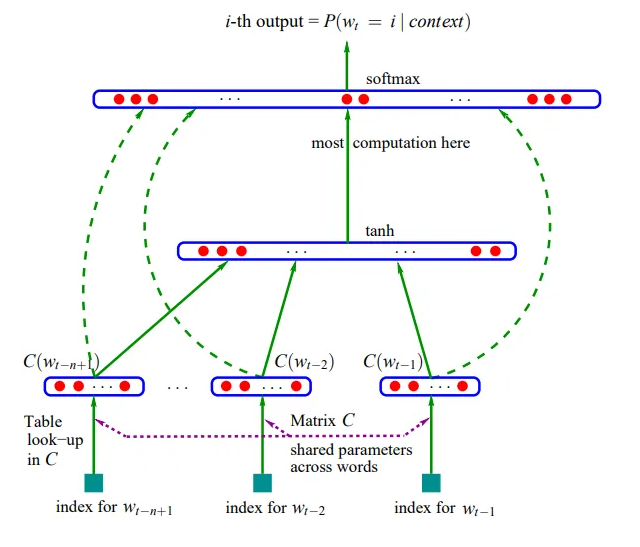

# MakeMore, a classifier neural network

Vogliamo creare una rete con 3 layer:
* input layer
* hidden layer
* output layer

Per la definizione di rete neurale, i neuroni dello stesso layer non comunicano tra di loro.  
Ogni neurone è completamente connesso al neurone del layer successivo, per cui l'uscita di un neurone
vanno in ingresso di tutti i neuroni del layer successivo.



Pensando di voler implementare le rete makemore, 27 caratteri dell'alfabeto codificati in lookup table (embeddings),
rete che accetta sequenze di 3 caratteri in input per produrre un quarto carattere in output, possiamo procedere così:  

#### Input layer
Avremo 27 neuroni, ognuno ha un input che accetta uno tra i 27 caratteri dell'alfabeto.  

```py
# input, sequenze di 3 caratteri, immaginiamo di avere 32 input..
X = [
    [5, 13, 13],
    [13, 13, 1],
    [...],
    ...,
    ,,,
]
# X.shape = [32, 3]

# Input layer 
emb = C[X]
# emb.shape =  torch.Size([32, 3, 2])
# emb contiene 32 righe, ogni riga ha 3 elementi, cioè 3 array,
# ogni array contiene due numeri, cioè la codifica di un carattere nello spazio a 2 dinensioni (carattere embeddato)
```

Possiamo considerare emb come il nostro input layer:  
ci sono 27 neuroni, ognuno accetta in ingresso 1 carattere,  
C è la **matrix** dei pesi.  

#### Hidden layer
Avremo un numero di neuroni prefissato in progetto, es.: 100.  
ogni neurone accetta in input tutti gli output dei neuroni dell'input layer, che sono:   emb.shape =  torch.Size([32, 3, 2])  -> "tre volte due"  cioè 6 input.  
Quindi creiamo i pesi e bias per i neuroni:  
```py
# 6 righe (input), ogni riga contiene 1 array di 100 numeri (pesi), uno per ogni neurone
W1 = torch.randn([6, 100])

# 100 bias, uno per ogni neurone
b1 = torch.randn(100)

# output dell'hidden layer
# Y1 = W1 @ emb + b1

# N.B.:  W1 @ emb --> ERRORE! --> shapes cannot be multiplied (96x2 and 6x100)
# forme dei tensori non compatibili!!
# cambiamo forma emb:
emb.view(32, 6) 

h = emb.view(32, 6) @ W1 + b1
# h shape = torch.Size([32, 100])

# supponiamo anche che esista una funzione di attivazione tanh
h = torch.tanh(emb.view(32, 6) @ W1 + b1) 
# h shape = torch.Size([32, 100])

# h rappresenta le attivazioni dei 100 neuroni 
```


#### Output layer
Avremo 27 neuroni nel layer, perché possiamo avere uno tra 27 caratteri, come quarto carattere da prevedere nella sequenza.  
Ha 100 input ( gli output dei neuroni dell'hidden layer)  
Ed ha 27 output    

```py
# 100 input, 27 output
# avremo 100 righe, ogni riga contiene un array di 27 pesi.
W2 = torch.randn([100, 27])
b2 = torch.randn(27)

logits = h @ W2 + b2
# logits shape =  torch.Size([32, 27])
# la forma 
```
la forma dei logits è ok perché per 32 righe (le 32 stringhe in input), avremo 27 possibili output


## Calcolo dell'output della rete (forward pass)


```py
# forward pass
  emb = C[X] # (32,6)
  h = torch.tanh(emb.view(32, 6) @ W1 + b1) # (32, 100)
  logits = h @ W2 + b2 # (32, 27)
  loss = F.cross_entropy(logits, Y)
```

## Backpropagation della rete (backward pass)

Agendo su tutti i parametri della rete, impostiamo i gradienti.
```py
parameters = [C, W1, b1, W2, b2]
for p in parameters: # dotiamoli di gradiente
    p.requires_grad = True
```
iterando per **epoch** n volte 
effettuiamo il passaggio in avanti,  
poi calcoliamo tutti i gradienti   
e quindi aggiorniamo i valori dei parametri, applicando un certo **learning rate**. 

```py
epoch = 100
learning_rate = -0.1

for _ in range(epoch): # epoch
    for p in parameters: # safety: inizializzare tutti i gradienti a None 0 a zero.
        p.grad = None

    # 1) forward pass
    emb = C[X] # (32,6)
    h = torch.tanh(emb.view(32, 6) @ W1 + b1) # (32, 100)
    logits = h @ W2 + b2 # (32, 27)
    loss = F.cross_entropy(logits, Y)
    
    # 2) backward pass, calcoliamo tutti i gradienti
    print ('loss=', loss.item())

    loss.backward()

    # 3) update dei parametri
    for p in parameters:
        p.data += -learning_rate * p.grad

```