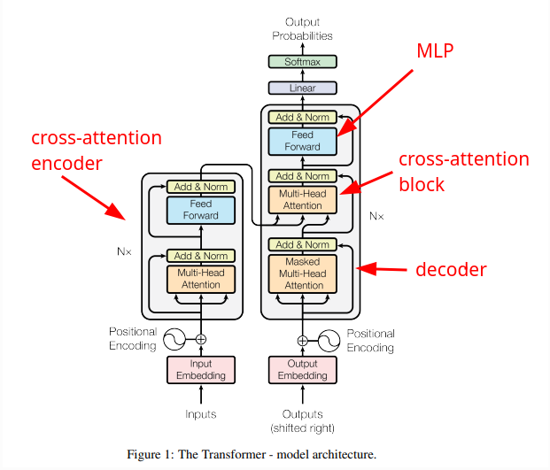

# Transformer

Alla base del **GPT** abbiamo implementato dei blocchi (Self-attention, feed forward), che fanno parte di un'architettura generica chiamata **Transformer**.  

   

Nel nostro caso del GPT, abbiamo creato un decoder e aggiunto un blocco di feed-forward.  
Abbiamo ignorato sia l'encoder esterno, sia il blocco di cross-attention che serve per legare l'encoder al nostro decoder.  

Il nostro GPT prende in input un file di testo e lo modella, cercando di imitarlo, generando testo a partire dal modello stesso.
Infatti è un generatore di testo ed il token n non è condizionato dai token futuri da n+1 in poi.  

Il blocco dell'encoder e cross-attention viene usato nel caso in cui la rete debba essere un traduttore automatico.  

Immaginiamo una traduttore dal francese all'inglese, prende in input le frasi:

```py
# <--------- ENCODE ------------------><--------------- DECODE ----------------->
# les réseaux de neurones sont géniaux! <START> neural networks are awesome!<END>
```
La frase in inglese è fornita in input al decoder, così come fatto per il nostro GPT.  
La frase in francese è fornita in input all'encoder, può essere vista come una informazione aggiuntiva che è associata alla frase in inglese.  

I token dell'input in francese potranno comunicare tra di loro, sia i passati che i futuri, 
perché nell'encoder non viene usata la matrix 'tril' triangolare che limita le comunicazioni verso token futuri.  
Quando i token degli input in inglese vengono processati dal decoder, le **query** vengono generate
a partire dagli input del decoder X, ma le **keys** e i **values** provengono dall'encoder, che contiene informazioni riguardo i token degli input in francese.  
Il blocco di cross-attention si occupa di mettere in comunicazione le query del decoder con le keys e i values dell'encoder.  


