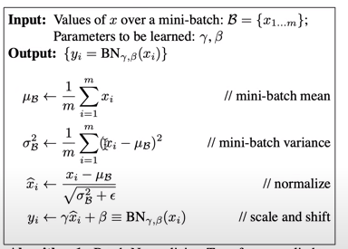

# Batch Normalization
E' un metodo per ottimizzare efficacemente il training di rete neurali profonde.

```py
# durante il forward pass:..
emb = C[Xb] # embed the characters into vectors
embcat = emb.view(emb.shape[0], -1) # embcat è una distribuzione gaussiana

# hpreact non è una distribuzione gaussiana, perché influenzata da W1 e b1
hpreact = embcat @ W1 + b1 
```
In sostanza abbiamo visto che **hpreact** (tensore degli **stati di preattivazione** del layer nascosto della rete) non vogliamo che sia di intervallo troppo piccolo, perché tanh() non si attiverebbe mai, e non vogliamo che sia di intervallo troppo grande, perché porterebbe tanh() in saturazione.  

Vorremmo, cioè, che hpreact sia una **distribuzione gaussiana uniforme**, come già visto per i valori di input della rete.  

Quindi lo scopo è **normalizzare gli stati di preattivazione degli hidden layer** per renderli distribuzioni gaussiane,
attraverso l'applicazione di un algoritmo di normalizzazione chiamato **batch normalization**.

  

Per prima cosa calcoliamo la **media** e la **deviazione standard** di hpreact,
poi **normalizziamo**: sottraendo la media da hpreact e dividendo il tutto per la deviazione standard, con l'aggiunta di un piccolo epsilon,
per scongiurare eventuali divisioni per zero, in caso std = 0
```py
# mean
bnmeani = hpreact.mean(0, keepdim=True)
# standard deviation
bnstdi = hpreact.std(0, keepdim=True)
# epsilon 
eps = 1e-5
# normalization = (hpreact - mean) / std + epsilon
hpreact = (hpreact - bnmean) / bnstdi + eps
```
A questo punto ogni neurone di hpreact avrà una frequenza di attivazione che è gaussiana uniforme per ogni sample in input  
(es.: batch_size= 32, per ognuno dei 32 input possibili del batch).  
Ecco perché si parla di **normalizzazione del batch dei dati di input**!  

A questo punto riusciamo a rendere le frequenze di attivazioni di tipo gaussiano, ma vogliamo che lo siano solo all'inizializzazione
della rete, non forzarli ad esserlo anche durante il training.

Vorremmo che hpreact gaussiano si stabilizzasse durante la backpropagation, spostandosi e ridimensionandosi adeguatamente.    
L'ultima parte dell'algoritmo prevede l'introduzione di un array di **scale**  e uno di **shift** (spostamento).  
Scale viene usato per ridimensionare hpreact attraverso un certo gain.  
Shift viene usato per spostare hpreact tramite un certo bias.  
In sostanza questi array servono per **stabilizzare** la rete durante il training.

```py
# es con 200 neuroni:
n_hidden = 200 
# inizializziamo i due array:
bngain = torch.ones((1, n_hidden)) 
bnbias = torch.zeros((1, n_hidden))

# applichiamoli come previsto dall'algoritmo:
hpreact = (bngain * (hpreact - bnmean)) / bnstdi + eps + bnbias
```
bngain e bnbias all'inizializzazione, assicurano una forma gaussiana di hpreact.  
Durante il training verranno modificati per ridimensionare e spostare hpreact.  
Sono cioè dei **parametri della rete**, come i pesi e i bias, e verranno sottoposti a calcolo del gradiente,
come tutti gli altri parametri, durante la backpropagation

```py
# vanno aggiunti all'array dei parametri
parameters = [W1, b1, W1, b2, bngain, bnbias]
```

La normalizzazione deve essere fatta **per ogni iterazione del processo di forward**, durante il training.  
Ad ogni ciclo di iterazione vanno quindi calcolati, media e deviazione standard, e va applicata la normalizzazione.  
Di solito viene effettuata dopo una moltiplicazione di preattivazione o dopo uno strato di layer convoluzionale.  

#### Medie mobili esponenziali
Inizializzeremo anche **bnmean_running** e **bnstd_running**, due **buffers** che conterrano i valori di media e std degli input durante
le iterazioni del forward pass (**medie mobili esponenziali**), che non prenderanno parte alla backpropagation, ma verrano addestrati con questa operazione:  

**bnmean_running = 0.999 * bnmean_running + momentum * mean**  
**bnstd_running = 0.999 * bnstd_running + momentum * std_deviation**  

che è una sorta di aggiornamento delle medie mobili. 
Il **momentum** (slancio) è un valore numerico (es 0.1, 0.001 etc) di solito molto piccolo.  
Per batch di grandi dimensioni può andar bene 0.1, ma per batch piccoli (32 elementi come nell'esempio)
va usato un valore più piccolo es. 0.001, perché le medie e le std nei buffer possono variare molto, prima di convergere, ed è bene non accentuare le loro variazioni,
usando momentum che non aiuterebbero a stabilizzare, aumentando il **thrashing** dei valori nei buffer.


#### Rimozione bias b1
Possiamo rimuovere dai parametri il bias **b1** perché è sostanzialmente inutile. Infatti prima lo aggiungiamo ad **hpreact**,
ma poi, siccome calcoliamo la media per ogni neurone e andiamo a sottrarre tale media da hpreact, e, siccome questa media comprende
anche la presenza di b1, possiamo eliminarlo, perché è solo uno spreco nei calcoli del gradiente.   
Il suo effetto viene inglobato nel bias **bnbias**.  

L'implementazione prevede:
* inizializzazione dei parametri
* addestramento in loop:
  * forward pass con creazione di un layer lineare
  * applicazione del layer batchnorm
  * applicazione della non linearità (tanh())

```py
# MLP revisited
n_embd = 10 # the dimensionality of the character embedding vectors
n_hidden = 200 # the number of neurons in the hidden layer of the MLP

g = torch.Generator().manual_seed(2147483647) # for reproducibility
# net parameters
C  = torch.randn((vocab_size, n_embd),            generator=g)
W1 = torch.randn((n_embd * block_size, n_hidden), generator=g) * (5/3)/((n_embd * block_size)**0.5) #* 0.2
#b1 = torch.randn(n_hidden,                        generator=g) * 0.01
W2 = torch.randn((n_hidden, vocab_size),          generator=g) * 0.01
b2 = torch.randn(vocab_size,                      generator=g) * 0

# BatchNorm parameters
bngain = torch.ones((1, n_hidden)) # scale
bnbias = torch.zeros((1, n_hidden)) # shift
momentum = 0.001

#batchNorm buffers
bnmean_running = torch.zeros((1, n_hidden))
bnstd_running = torch.ones((1, n_hidden))

parameters = [C, W1, W2, b2, bngain, bnbias]
print(sum(p.nelement() for p in parameters)) # number of parameters in total
for p in parameters:
  p.requires_grad = True

# end initialization

# begin iterations:
max_steps = 200000
batch_size = 32
lossi = []
eps = 1e-5

for i in range(max_steps):
  
  # minibatch construct
  ix = torch.randint(0, Xtr.shape[0], (batch_size,), generator=g)
  Xb, Yb = Xtr[ix], Ytr[ix] # batch X,Y
  
  # forward pass
  # -------------------------------------------------------------
  emb = C[Xb] # embed the characters into vectors
  embcat = emb.view(emb.shape[0], -1) # concatenate the vectors
  # Linear layer
  hpreact = embcat @ W1 # + b1 # hidden layer pre-activation
  # -------------------------------------------------------------

  # BatchNorm layer
  # -------------------------------------------------------------
  bnmeani = hpreact.mean(0, keepdim=True)
  bnstdi = hpreact.std(0, keepdim=True)
  hpreact = bngain * (hpreact - bnmeani) / bnstdi + eps + bnbias

  with torch.no_grad(): # la media e la std non necessitano di avere un gradiente da calcolare!
    bnmean_running = 0.999 * bnmean_running + momentum * bnmeani
    bnstd_running = 0.999 * bnstd_running + momentum * bnstdi
  # -------------------------------------------------------------

  # Non-linearity and calculate loss function
  h = torch.tanh(hpreact) # hidden layer
  logits = h @ W2 + b2 # output layer
  loss = F.cross_entropy(logits, Yb) # loss function
  
  # backward pass
  # -------------------------------------------------------------
  for p in parameters:
    p.grad = None
  loss.backward()
  
  # update
  learning_rate = 0.1 if i < 100000 else 0.01 # step learning rate decay
  for p in parameters:
    p.data += -learning_rate * p.grad
  # -------------------------------------------------------------

  # track stats
  if i % 10000 == 0: # print every once in a while
    print(f'{i:7d}/{max_steps:7d}: {loss.item():.4f}')
  lossi.append(loss.log10().item())
```

#### Side Effect di regolarizzazione
Batch normalization introduce un **rumore stocastico** (aleatorio, casuale) durante il processo di training.
Questo rumore aiuta a prevenire l'**overfitting**, migliorando le capacità del modello di generalizzare su dati non visti.  
Tale rumore viene introdotto perché, ogni volta che operiamo una normalizzazione sui dati casuali del mini-batch,
tramite i buffer, teniamo traccia delle medie degli input precedenti, che peraltro, sono dati casuali.  
Quindi l'output della rete tiene conto di TUTTI gli input del batch, in un certo senso, producendo un benefico effetto di regolarizzazione.
