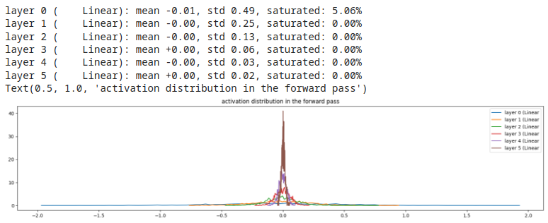

# Considerations

### Comportamento di una rete neurale in assenza di attivazioni non lineari  
Quando abbiamo una rete neurale di più layer lineari sovrapposti, e **non** usiamo alcuna **non-linearità** nelle **funzioni di attivazione**,
il **gain** influenza la rete nel seguente modo:

#### Esempio 1, gain = 0.5 (gain basso)
  

restringe gli output verso lo zero. **Comportamento da evitare!**

  

inoltre, rende i gradienti dei layer interni sempre più espansi, diffondendoli. **Comportamento da evitare!**
 

#### Esempio 2, gain = 3 (gain alto)
 

manda in **saturazione** il mondo! **Comportamento da evitare!**

 

e, di conseguenza, rende tutti i gradienti pari a zero.  **Comportamento da evitare!**  

#### Esempio 3, gain = 1 (no gain)

 

buona distribuzione degli output, valori di saturazione notevoli, non eliminabile in caso di sola linearità

  

e, in linea di massima, buone distribuzioni dei gradienti, con **curve molto simili** per tutti layer.  

L'utilizzo di gain pari a 1 (no gain) assicura un comportamento corretto per una rete di soli layer lineari.  
Tuttavia, l'uso di non linearità nelle funzioni di attivazione permette un funzionamento migliore della rete, perché
riusciamo a modellare relazioni più complesse (**pattern** complessi nei dati di input), oltre ai semplici pattern lineari.  

Riuscire a trovare un corretto valore del gain, in presenza di non-linearità nelle funzioni di attivazione, può diventare estremamente complicato,
soprattutto quando la rete è molto profonda.  
Per questo ci vengono in aiuto ottimizzazioni come **batch normalization**, **group normalization** etc. 

