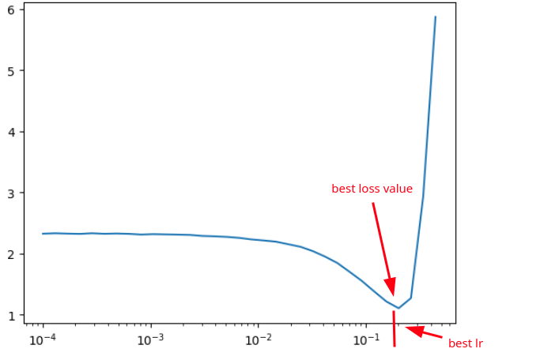
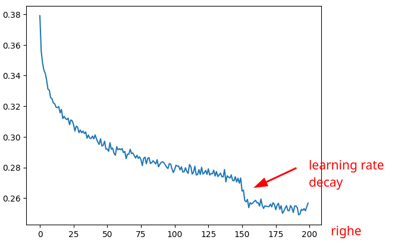

# Learning Rate

Scelto il valore del learning rate da usare, esso va applicato nell'algoritmo del backpropagation:

es.: partiamo dal seguente algoritmo di backward
```py
epoch = 100
learning_rate = -0.001

for _ in range(epoch):
    for p in parameters: # safety: inizializzare tutti i gradienti a None 0 a zero.
        p.grad = None

    # 1) forward pass
    emb = C[X] # (32,6)
    h = torch.tanh(emb.view(32, 6) @ W1 + b1) # (32, 100)
    logits = h @ W2 + b2 # (32, 27)
    loss = F.cross_entropy(logits, Y)
    
    # 2) backward pass, calcoliamo tutti i gradienti
    print ('loss=', loss.item())

    loss.backward()

    # 3) update dei parametri
    for p in parameters:
        p.data += -learning_rate * p.grad

```
#### Aumento del learning rate

Immaginando di voler considerare learning_rate diversi nell'intervallo [0,0001, 1], possiamo creare tanti valori equidistanti tra loro 
in quell'intervallo:

```py
 # invece di fare direttamente:
 learning_rates = torch.linspace(0.0001, 1, 1000)

 # creiamo prima gli esponenti:
 lre = torch.linspace(-1, 0, 1000)
 learning_rates = 10**lre
 # learning_rates = tensor([0.1000, 0.1002, 0.1005, 0.1007, 0.1009, 0.1012, 0.1014, 0.1016, ..., 1.0000])

```
Adesso applicando questi learning_rates all'algoritmo di backward faremo in modo che all'aumentare delle iterazioni per le epoch,
difatto verranno usati learning rates **sempre più alti**.  
Plottando in istogramma con asse delle ascisse i valori del learning rate ed in ordinate il loss, si nota subito il miglior valore di learning rate da usare.  
Da come si nota nel grafico, una volta raggiunto un ottimale valore del learning rate è ragionevole **fermare il training** del modello, visto che dopo inizia ad aumentare il valore del loss!

 

```py
epoch = 10000
learning_rate = -0.001

lre_results = []
lr_results = []
loss_results = []

for i in range(epoch):
    for p in parameters: # safety: inizializzare tutti i gradienti a None 0 a zero.
        p.grad = None

    # 1) forward pass
    emb = C[X] # (32,6)
    h = torch.tanh(emb.view(32, 6) @ W1 + b1) # (32, 100)
    logits = h @ W2 + b2 # (32, 27)
    loss = F.cross_entropy(logits, Y)
    
    # 2) backward pass, calcoliamo tutti i gradienti
    print ('loss=', loss.item())

    loss.backward()

    # 3) update dei parametri
    lr = learning_rates[i]
    for p in parameters:
        p.data += -lr * p.grad

    # track stats:
    lr_results.append(lr)
    lre_results.append(lre[i]) # memorizza l'esponente
    loss_results.append(loss.item())

```

Possiamo graficare i risultati per vedere chiaramente come influiscono i vari valori del learning rate
sulle perdite:
```py
 #plt(asse_x, asse_y)

 plt(lr_results, loss_results)

```

Ma ancora più interessante è graficare l'array degli esponenti e i risultati delle perdite,
perché mostra più chiaramente ancora la situazione e, quindi, la scelta di un corretto learning rate.
```py
 plt(lre_results, loss_results)

```

Quindi se dal grafico vediamo che un buon esponente è, ad esempio, -1, useremo come learning rate:  
```py
learning_rate = 10**-1 = 0.1
```

#### Decadimento del learning rate
E' possibile anche usare learning rates variabili in base alle iterazioni.  
Esempio:
```py
learning_rate = 0.1 if i < 100000 else 0.01 # step learning rate decay
```

#### Semplificazioni (lossi)
Per migliorare la visualizzazione in grafico, usiamo un'array **lossi** che contiene il **log10** del valore del loss, per evidenziare meglio l'leffetto del learning rate
durante il training.     

esempio:  

```py
max_steps = 200000
batch_size = 32
lossi = []

for i in range(max_steps):
  
  # minibatch construct
  ix = torch.randint(0, Xtr.shape[0], (batch_size,))
  Xb, Yb = Xtr[ix], Ytr[ix] # batch X,Y
  
  # forward pass
  logits = model(Xb)
  loss = F.cross_entropy(logits, Yb) # loss function
  
  # backward pass
  for p in parameters:
    p.grad = None
  loss.backward()
  
  # update: simple SGD
  lr = 0.1 if i < 150000 else 0.01 # step learning rate decay
  for p in parameters:
    p.data += -lr * p.grad

  # track stats
  if i % 10000 == 0: # print every once in a while
    print(f'{i:7d}/{max_steps:7d}: {loss.item():.4f}')
  lossi.append(loss.log10().item())

```  
Per semplificare il grafico del loss, mettiamo lossi in un tensore e ne calcoliamo la media dei suoi valori ogni 1000 elementi.  

```py
t = torch.tensor(lossi) # shape = [200000]

# modifico la forma per ottenere n righe da 1000 elementi
t.view(-1, 1000) # shape = [200, 1000] 

# calcolo la media
t.view(-1, 1000).mean(1)

# creo il grafico:
plt.plot(t.view(-1, 1000).mean(1))
```

che mostra chiaramente l'effetto del learning rate:

 
