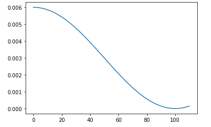

# Pytorch Optimizers Characteristics

Gli optimizers di pytorch contengono al loro interno le caratteristiche che abbiamo visto, oltre a delle altre.  

es di **__repr__()** di un optimzer SGD, dopo aver eseguito un training loop:

```py
SGD (
Parameter Group 0
    dampening: 0
    differentiable: False
    foreach: None
    lr: 0.01
    maximize: False
    momentum: 0
    nesterov: False
    weight_decay: 0
)
```
 ### Param groups
I parametri dell'optimizer vengono salvati dentro la list **param_groups**. Ogni elemento della lista è del tipo:

```py
pg = opt.param_groups[0] # pg è un dict
list(pg)  # get all pg keys..

#output:
['params', #parametri: pesi
 'lr', # iperparametri
 'momentum', # iperparametri
 'dampening',  # iperparametri
 'weight_decay', # iperparametri
 'nesterov', # ....
 'maximize', 
 'foreach',
 'differentiable']

 #es: valore del learning rate utilizzato:
 pg['lr']
#output:
0.01
```
Ogni elemento della lista param_groups contiene cioè tutti i parametri ed iperparametri usati all'interno dell'optimzer per un particolare learning rate.
Per ogni nuovo learning rate che sperimentiamo, verrà aggiunto un nuovo elemento alla lista, con i valori relativi al nuovo learning rate.


### State

Un optimizer contiene un dict particolare, **state** che ha per keys i parametri del modello, cioè dei tensori.  
Da come come abbiamo visto, all'interno di un optimizer (es.: RMSProp, ADAM), per ogni parametro vengono calcolati dei valori (medie dei gradienti etc), che andranno poi salvati nello stato.  
Tali valori sono contenuti nel dict **state** e vi si può accedere usando come chiave il parametro stesso, in quanto sono il value per la data key del dict state.  

```py
opt.state
```

# Pytorch Schedulers Characteristics
Un optimizer viene passato come parametro ad uno dei numerosi scheduler presenti in pytorch.  
Lo scheduler prende il learning rate iniziale dell'optimizer e lo salva nella list **base_lrs**,
poi esegue una sua funzione **step()** in cui decide se e come regolare il valore del learning rate da passare all'optimzer.  

esempio:
```py
from torch.optim import lr_scheduler

sched = lr_scheduler.CosineAnnealingLR(opt, 100)

sched.base_lrs  # [0.01]

sched.get_last_lr() # es: [0.06]

```


NOTA:
Funzione di utilità che plotta l'andamento dei learning rate creati dallo scheduler, prendendo come parametri lo scheduler e un numero di epochs

```py
def sched_lrs(sched, steps):
    lrs = [sched.get_last_lr()]
    for i in range(steps):
        sched.optimizer.step()   # fa avanzare l'optimzer
        sched.step() # step per regolare il learning rate
        lrs.append(sched.get_last_lr())
    plt.plot(lrs)

sched_lrs(sched, 110) 
```
Nell'esempio si nota come superate le 100 epochs il learning rate inizia ad aumentare, dopo che ha raggiunto il suo minimo a circa 100 epochs.  



