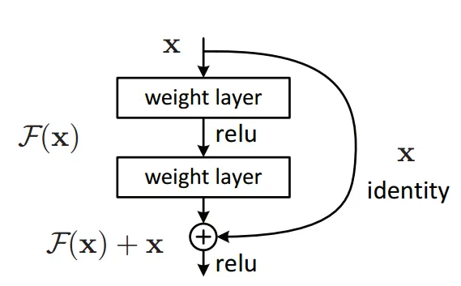

# Optimize deep neural networks

Le reti neurali profonde sono più difficili da addestrare.  
Esistono delle tecniche specifiche di ottimizzazione che aiutano durante il training di queste reti.  

#### Residual connections
La tecnica delle **connessioni residue** è usata, per esempio, nel **transformer**.  
Serve per ottimizzare il training della rete, almeno durante la fase dell'inizializzazione dei pesi.  
Abbiamo visto che normalmente l'informazione procede attraverso i layer di neuroni, in sequenza.    
Aggiungendo un **blocco residuo**, accade che l'informazione, oltre che procedere sequenzialmente,
salta un paio di layer per riproporsi direttamente più avanti nella rete.

 

Quindi, alla fine dell'elaborazione mostrata in figura, avremo che l'output dell'ultimo layer
è pari all'input elaborato lungo la rete + l'input precedente le elaborazioni.  

Ragionando nell'ottica di backpropagation, in direzione dall'output verso l'input, avremo che il gradiente del loss attraversa tutti i layer a ritroso, per arrivare all'input.  
Tuttavia imbocca anche il blocco residuo (che è un tipo di blocco **super-highway**) e si propone direttamente in input, senza elaborazioni.  
In fase di inizializzazione della rete o, comunque, durante i primi cicli di training, l'effetto dei layer sul gradiente del loss è poco influente, per cui è accettabile riproporre tale gradiente direttamente in input, senza aspettare le elaborazioni fate nei layer.  
Con il passare del tempo, durante, il training, l'entità dei gradienti calcolati all'interno dei layer iniziano ad assumere maggiore importanza e possono essere sommati al gradiente del loss che viaggia lungo il blocco residuo.  

Una implementazione nel transformer, consiste semplicemente nell'addizionare x in fase di forward:  

```py
class Block(nn.Module):
    """ Transformer block: communication followed by computation """

    def forward(self, x):
        x = x + self.sa(self.ln1(x)) # residual connection, note x +
        x = x + self.ffwd(self.ln2(x)) # residual connection, note x +
        return x
```

e nel **proiettare** gli x del blocco residuo in un layer lineare (**projection layer**), per aggiungerli alla rete:  
```py
class MultiHeadAttention(nn.Module):
    """ multiple heads of self-attention in parallel """

    def __init__(self, num_heads, head_size):
        super().__init__()
        self.heads = nn.ModuleList([Head(head_size) for _ in range(num_heads)])
        self.proj = nn.Linear(head_size * num_heads, n_embd) # projection layer
        self.dropout = nn.Dropout(dropout)

class FeedFoward(nn.Module):
    """ a simple linear layer followed by a non-linearity """

    def __init__(self, n_embd):
        super().__init__()
        self.net = nn.Sequential(
            nn.Linear(n_embd, 4 * n_embd),
            nn.ReLU(),
            nn.Linear(4 * n_embd, n_embd),  #projection layer
            nn.Dropout(dropout),
        )

```

