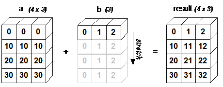

# Broadcasting

Non sempre è possibile effettuare operazioni aritmetiche tra tensori di forme differenti.  
Molte volte si ha necessità di modificare la forma di uno dei due tensori.  

Immaginiamo di voler effettuare l'addizione tra due tensori, di forme differenti.  

```py
# a.shape = [4, 3]
# b.shape = [1, 3]

c = a + b 
# c.shape = [4, 3]
```



pytorch replica l'unica riga presente nel tensore b, espandendolo, e permettendo di fare l'addizione per ogni riga di **a** con l'unica riga di **b**.  
Questo effetto di espandere (**stretch**) il tensore di **rank** inferiore, per adattarlo al tensore di **rank** superiore è detto **broadcasting**.  

#### Regole per il brodcasting
Per effettuare il broadcasting è indispensabile che uno dei due tensori abbia un **rank almeno pari a 1**.  
Il broadcasting può essere effettuato tra due tensori di **dimensioni compatibili**:  
Confrontando i due tensori partendo dall'ultima dimensione, due dimensioni sono compatibili quando è valida una delle regole:  
* sono uguali
* una delle due dimensioni è di size pari a 1

poi si procede a ritroso fin quando i due tensori hanno entrambi una dimensione per lo stesso rank.  
Esempi:  

```py
a = torch.ones(0,)
b = torch.ones(3, 4)
# a shape = [0]
# b shape = [3, 4]
# a and b are not broadcastable because a has rank 0

x=torch.empty(5,3,4,1)
y=torch.empty(  3,1,1)
# 1st trailing dimension: both have size 1
# 2nd trailing dimension: y has size 1
# 3rd trailing dimension: x size == y size
# 4th trailing dimension: y dimension doesn't exist
# x and y are broadcastable.

x=torch.empty(5,2,4,1)
y=torch.empty(  3,1,1)
# x and y are not broadcastable, because in the 3rd trailing dimension 2 != 3

```

Quando tra due tensori è possibile applicare il broadcast, a seguito dell'operazione aritmetica effettuata, si avrà che il tensore risultante dall'operazione
sarà calcolato in questo modo:  
* se i tensori non hanno lo stesso rank, verrà anteposta dimensione di **size 1** al tensore di rank minore per stretcharlo ed allinearlo al tensore di rank maggiore  

* la dimensione risultante sarà il massimo tra le dimensioni dello stesso rank dei due tensori di partenza, perché i valori della dimensione pari a 1 vengono replicati (**broadcasted**) lungo la dimensione maggiore per permettere l'operazione aritmetica.

```py
# can line up trailing dimensions to make reading easier
x=torch.empty(5,1,4,1)
y=torch.empty(  3,1,2)

# x.shape = [5,1,4,1]
# y.shape = [  3,1,2]

# implicitamente pytorch farà:
y = y[None, :]  # prepend dimension of size 1
# y.shape = [1,3,1,2]

>>> s = x + y
# x.shape = [5,1,4,1]
# y.shape = [1,3,1,2] # use tensor with prependeded dimension in sum operation

# s.shape = [5,3,4,2] # sum shape, with max size between sizes along same dimension

```
