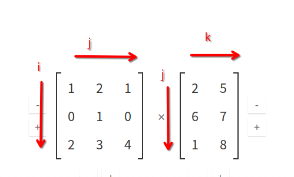
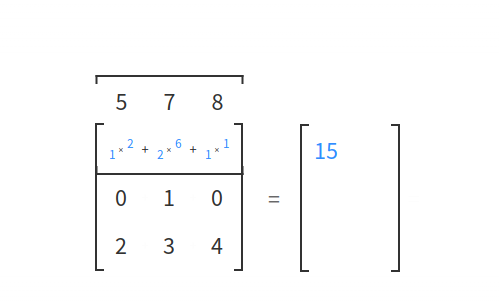

# Einsum

Le operazioni di algebra lineare sui tensori possono anche essere effettuate tramite **torch.einsum**, sfruttando la **Einstein notation**.  

**torch.einsum(equation, \*operands)** 

i parametri della funzione sono una stringa che è l'**equazione** da applicare e una lista di **operandi** (tensori).  
Vengono etichettate tutte le dimensioni degli operandi con delle lettere (**Label o Indices**) e vengono definite le dimensioni che 
faranno parte dell'output.  
L'output viene calcolato sommando il prodotto degli elementi degli operandi lungo le dimensioni etichettate che **NON** fanno parte dell'output.

## Regole di composizione dell'equazione
Immaginando di avere due operandi, **è importante che le dimensioni dei due operandi che sono etichettate con la stessa lettera 
siano broadcastable oppure di size pari a 1**  

Le dimensioni coinvolte nell'output vengono definite esplicitamente facendole seguire al **->**  nell'equazione.  
In alternativa, senza usare una definizione esplicita per l'output, le dimensioni che appaiono una sola volta faranno parte dell'output, catalogate per ordine alfabetico.  

**L'output** è calcolato effettuando in sequenza le operazioni:

1) moltiplicazione degli operandi elemento per elemento con le loro dimensioni allineate secondo le regole descritte dall'equazione.
2) somma delle dimensioni che non sono presenti nell' output dell'equazione


Gli indices (dimensioni) si dividono quindi in due tipi:

* **Free Indices**: specificati nell'output
* **Summation Indices**: le restanti dimensioni.

## Esempi

### Transpose

```py
a = torch.arange(6).view(2,3)
# a = tensor([[0, 1, 2],
#             [3, 4, 5]])

r = torch.einsum('ij->ji', a)
# r = [[0, 3]
#      [1, 4]
#      [2, 5]]

```

### Sum

```py
a = torch.arange(6).view(2,3)
# a = tensor([[0, 1, 2],
#             [3, 4, 5]])

torch.einsum('ij->', a) # tensor(15)
```
Le moltiplicazioni non vengono effettuate perché non c'è un secondo elemento nell'equazione, prima dell **->**.  
Le somme vengono effettuate per le dimensioni non presenti nell'output.  
L'effetto è di sommare tutti gli elementi del tensore.  

### Column Sum

```py
a = torch.arange(6).view(2,3)
# a = tensor([[0, 1, 2],
#             [3, 4, 5]])

r = torch.einsum('ij->j', a)
# r = tensor([.3, .5, .7])
```

### Row Sum

```py
a = torch.arange(6).view(2,3)
# a = tensor([[0, 1, 2],
#             [3, 4, 5]])

r = torch.einsum('ij->i', a)
# r = tensor([.3, .12])
```

### Dot Product 

Prodotti degli elementi corrispondenti poi sommati per produrre uno scalare.  
```py
a = torch.arange(3)   # [0,1,2]
b = torch.arange(3,6) # [3,4,5]

r = torch.einsum('i,i->', a)
# r = tensor([14])
```
Viene effettuata la moltiplicazione elemento per elemento lungo la dimensione **i** (colonna) e vengono poi sommati i valori delle moltiplicazioni lungo la dimensione non
presente nell'output, che è sempre la **i**:

(0 x 3) + (1 x 4) + (2 x 5) = 14


### Outer Product
```py
a = torch.arange(3) # [0, 1, 2]
b = torch.arange(3,7) # [3,4,5,6]

r = torch.einsum('i,j->ij', a, b)
# r = tensor([[ 0,  0,  0,  0],
#             [ 3,  4,  5,  6],
#             [ 6,  8, 10, 12]])
```
Viene effettuata la moltiplicazione elemento per elemento lungo la dimensione **i** (colonna) del primo tensore e lungo la colonna **j** del secondo.  
Non viene effettata alcuna somma perché le dimensioni sono entrambe presenti nell'output dell'equazione.  

### Hadamard Product  (Element-wise product)
Vengono moltiplicati gli elementi corrispondenti e viene ritornata la matrice corrispondente.  

Le matrici devono avere stesso shape!

```py
a = torch.arange(6).view(2,3)
# a = tensor([[0, 1, 2],
#             [3, 4, 5]])
b = torch.arange(3,9).view(2,3)
# b = tensor([[3, 4, 5],
#            [6, 7, 8]])

r = torch.einsum('ij,ij->ij', a, b)
# r = tensor([[ 0,  4, 10],
#             [18, 28, 40]])
```
Vengono moltiplicati gli elementi secondo le dimensioni espresse, ma non vengono poi effettuate somme, visto che entrambe le dimensioni sono presenti nell'output.  


### Matrix multiplication:
```py
torch.einsum('ij, jk->ik', X, Y)
```
in questo esempio **i** e **k** sono free indices e **j** è l'indice di somma, perché è l'indice lungo cui avviene la sommatoria.  

  



Come si nota dall'esempio le moltiplicazioni avvengono elemento per elemento per le dimensioni **i** e **k**, presenti nell'output dell'equazione:  

i[0,0] = 1, i[0,1] = 2, i[0,2] = 1  
k[0,0] = 2, k[1,0] = 6, k[2,0] = 1
 
e poi viene fatta la somma lungo la dimensione **j** non presente nell'output.
