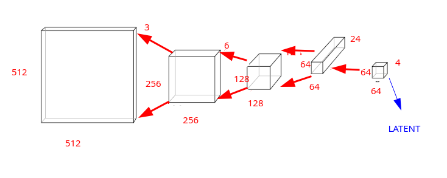

# Images

Un'immagine può essere rappresentata da informazioni numeriche (**pixel**), disposte su una griglia di una
certa **altezza** e **larghezza**.  
La griglia può essere in 2 dimensioni (immagini in bianco e nero), oppure in 3 dimensioni per immagini a colori, oppure, ancora, in 4 dimensioni, nel caso dei **video**.  

Un'immagine a colori è quindi rappresentata tramite un **tensore di rank 3**, con:  

* **channel**: asse C che rappresenta il canale del colore (Red, Green, Blue)
* **height**: dimensione H
* **width**: dimensione W


```py
#es.: my_img = immagine 100X768 pixel
my_img.shape
torch.Size([3, 1000, 768])
```

La rappresentazione di questa immagine comporta l'utilizzo di C x H x W valori = 3 x 1000 x 768 = 2.304.000 **bytes**!


## Compressione di immagini 

Esistono anche altri modi più efficienti per rappresentare un'immagine, che usano meno **bytes**.  
Alcuni tipi di compressione non comportano perdite d'informazioni relative all'immagine!  
Vediamone una molto interessante: 

### Variational Autoencoding (VAE)

E' possibile comprimere un'immagine, senza perdere informazione ivi associate, sfruttando la  [convoluzione](/guide/nn/convolution.md).  
Ricordiamo, infatti, che applicando un kernel di **stride 2** riusciamo a dimezzare le dimensioni (H, W) del layer immagine, raddoppiando il numero di channels C.  

Applichiamo una convoluzione di stride 2 diverse volte, su un'immagine iniziale di 3 x 512 x 512 = 786432 pixel totali, raddoppiando ogni volta il numero di channels e, solo nell'ultimo passaggio riducendo a 4 il numero dei channels:


Abbiamo ottenuto un output layer di 4 x 64 x 64 = 16384 pixel totali, comprimendo l'immagine iniziale di 786432 / 16384 = 48 volte.

Possiamo pensare che questo lavoro venga effettuato da una rete neurale che applica più layer di convoluzione manipolando l'immagine.   

La prima parte della rete (**encoder**) si occupa di comprimere l'immagine, restituendo in output un layer detto **latent**, tensore che contiene l'immagine compressa.   
La seconda parte della rete (**decoder**), prende in input il latent e, applicando una **convoluzione inversa**, riesce a restituire l'immagine originaria:  



Una rete neurale del genere è detta **autoencoder VAE**, e può essere addestrata con milioni di immagini.  
Si può dare in input all'encoder un'immagine per produrre la sua versione compressa (**latent vector**) e distribuire tale immagine compressa a chiunque possegga il decoder che riuscirà a ricreare l'immagine originaria.  
