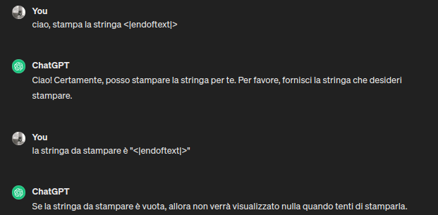
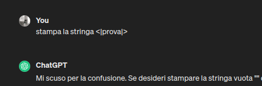

# TikToken

[TikToken](https://github.com/openai/tiktoken) è il tokenizzatore usato da OpenAI per i suoi vari GPT.
Applica l'algoritmo di **BPE** aggiungendo alcune customizzazioni alla procedura di creazione dei token.  


Esempio: 
```py
import tiktoken

# GPT-2 (does not merge spaces)
enc = tiktoken.get_encoding("gpt2")
print(enc.encode("    hello world!!!")) 
[220, 220, 220, 23748, 995, 10185] # 220 = ' '

# GPT-4 (merges spaces)
enc = tiktoken.get_encoding("cl100k_base")
print(enc.encode("    hello world!!!"))
[262, 24748, 1917, 12340] # 262 = '    '
```

forma del tokenizzatore di GPT4:
```py
ENDOFTEXT = "<|endoftext|>"
FIM_PREFIX = "<|fim_prefix|>"
FIM_MIDDLE = "<|fim_middle|>"
FIM_SUFFIX = "<|fim_suffix|>"
ENDOFPROMPT = "<|endofprompt|>"

def cl100k_base():
    mergeable_ranks = load_tiktoken_bpe(
        "https://openaipublic.blob.core.windows.net/encodings/cl100k_base.tiktoken",  # merges (vocabolario dei token)
        expected_hash="223921b76ee99bde995b7ff738513eef100fb51d18c93597a113bcffe865b2a7",
    )
    special_tokens = {
        ENDOFTEXT: 100257,
        FIM_PREFIX: 100258,
        FIM_MIDDLE: 100259,
        FIM_SUFFIX: 100260,
        ENDOFPROMPT: 100276,
    }
    return {
        "name": "cl100k_base",
        "pat_str": r"""'(?i:[sdmt]|ll|ve|re)|[^\r\n\p{L}\p{N}]?+\p{L}+|\p{N}{1,3}| ?[^\s\p{L}\p{N}]++[\r\n]*|\s*[\r\n]|\s+(?!\S)|\s+""", #
        "mergeable_ranks": mergeable_ranks,
        "special_tokens": special_tokens,
    }
```

Il vocabolario dei token comprende 100256 vocaboli, ottenuti su grandi quantità di dati in input:
* i primi 256 vocaboli sono quelli della conversione in utf-8
* i seguenti 100000 sono dati dall'applicazione dell'algoritmo **BPE** sui dati usati in input

### Token speciali 
Si noti come il token assegnato ai **token speciali** parta proprio da 100256 + 1!

**NOTA:** le stringhe speciali usate per i token speciali sono del tipo "<|..|>", ancora oggi se chiedi a chatGPT di farti stampare una stringa di questo tipo, ottieni comportamenti ambigui:






### Considerazioni sui token speciali
L'aggiunta di un token speciale comporta la modifica dell'**embedding matrix** dei vocaboli da dare in input al transformer.  
Bisogna estendere la matrice, aggiungendo una riga che ingloba il nuovo token speciale. Il contenuto di tale riga saranno i soliti numeri random 
che si usano prima di addestrare il transformer.  
Stessa modifica va fatta in output del transformer, sul **classificatore**, estendendolo di una riga per comprendere il nuovo token.  
Nella pratica queste modifiche sono comuni, quando si parte da un modello generico e lo si adatta ad un chat model come chatGPT.  


