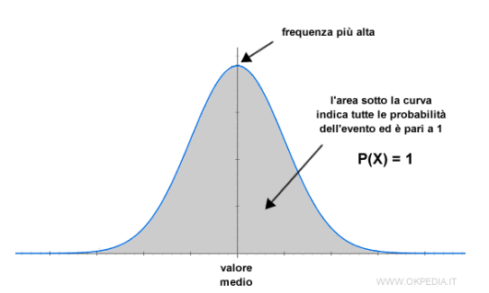

# Probability

#### Media Aritmetica
Somma dei valori numerici diviso il numero di valori numerici considerati.

#### Media Mobile
La media mobile di un insieme è una serie di medie di vari sottoinsiemi dell'insieme completo.  
In sostanza è la media calcolata per un intervallo minore di valori, rispetto al totale dei valori numerici considerati.


#### Varianza
E' una misura di dispersione,
indica la distanza di un insieme di valori numerici dal loro valore medio.


#### Deviazione Standard
Anche detto **scarto quadratico medio**, è la radice quadrata della varianza.  
Indice di dispersione statistico, fornisce una stima sintetica della dispersione della variabilità di un insieme di valori numerici.


#### Distribuzione di probabilità
Funzione matematica che fornisce le probabilità di occorrenza di diversi possibili risultati per un esperimento.

#### Distribuzione Gaussiana Uniforme
Distribuzione di probabilità che attribuisce le probabilità per tutti i valori dell'esperimento, considerato un certo intervallo [a, b].  
La maggior parte delle osservazioni (probabilità più alta) si concentrano attorno al valore medio della distribuzione.  
E' di forma simmetrica attorno alla media.  
Numericamente ha una media pari a zero ed una deviazione standard pari a 1.  
La deviazione standard di una distribuzione gaussiana misura la ripidità della forma a campana.  

  


#### ---------


Immaginiamo di avere una sequenza di 3 caratteri. Ad ogni carattere associamo una probabilità di occorrenza  

```py
g = torch.Generator().manual_seed(2147483647)

p = torch.rand(3, generator=g)
# p contiene 3 numeri random..
```
Se vogliamo lavorare con le probabilità possiamo ottenere la **distribuzione delle probabilità normalizzata**.  
p = p / p.sum()

Questo ci assicura che la somma delle probabilità della distribuzione sia pari a 1.

```py
# la probabilità dei 3 numeri è
p = p / p.sum() # p = tensor([0.6064, 0.3033, 0.0903])

# la somma della probabilità è 1.
p.sum() # tensor(1.)
```