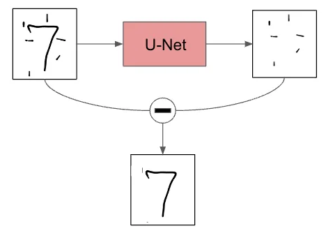

# Stable Diffusion

Modello di A.I. generativa che produce immagini a partire da **prompt di testi e  immagini**.   

Immaginiamo di avere un **modello** addestrato con le immagini 28x28 del DB **MNIST**,  che prende in input una qualsiasi immagine e produce in output la probabilità
che tale immagine sia una cifra numerica scritta a mano.

In che modo si potrebbe sfruttare tale modello per farlo produrre in output **nuove immagini** che siano delle cifre numeriche scritte a mano?  

Potremmo suddividere una immagine 28x28 su una griglia di 784 pixel totali e, pixel per pixel, potremmo provare a scurire o sbiancare un pixel, dare l'immagine modificata in input al modello e vedere se in output la probabilità che sia una cifra numerica aumenta o diminuisce.  
Possiamo eseguire tale procedimento per tutti i 784 pixel dell'immagine.  

In altri termini, il modello calcolerà **i gradienti** relativi a tutti i pixel dell'immagine rispetto al fatto che 
sia una cifra numerica scritta a mano.

Possiamo considerare gli input come se fossero composti da 2 immagini sovrapposte:
la cifra numerica + **rumore**

Quindi, di conseguenza, possiamo pensare che il modello preveda in output **quanto rumore** è stato aggiunto alla cifra numerica.  
**La quantità di rumore** ci dice quanto l'output somiglia ad una cifra numerica.
Se c'è poco rumore avremo una cifra numerica, altrimenti no.  

Quello che il modello cerca di fare è restituire in output la quantità di rumore presente in input,
e applicando una **loss function MSE** tra rumore predetto e rumore in input, si capisce di quanto
il modello riesce a prevedere fedelmente le cifre numeriche e quindi a crearle.  
Possiamo prendere le immagini del MNIST, applicare un layer di rumore random sopra di esse e istruire il modello con queste immagini composte, calcolare poi la loss function ed aggiornare i pesi del modello.  

## U-Net
Una volta che il modello è addestrato, possiamo anche dare in input **solo rumore** ed il modello restituirà
in output lo stesso rumore pulito in alcune parti, per far emergere alcuni tratti dell'immagine che si vuole ottenere.  
Sottraendo tale output all'input, avremo qualche pixel che, in effetti, fa sembrare il nuovo input più simile ad un cifra numerica e in output avremo del nuovo rumore da sostituire all'input.  
Effettuando questa procedura più volte, per sottrazione, ricaveremo un'immagine sempre più chiara di una cifra numerica!  
Un rete del genere è chiamata **U-Net** e sfrutta internamente la convoluzione.

Qui è mostrato il suo funzionamento per sottrazione di rumore:

## VAE Autoencoder
Nella realtà non si usano immagini 28x28, ma molto più grandi! Per tenere il numero di calcoli dei gradienti dentro limiti accettabili, possiamo ridurre il numero di pixel dell'immagine, usando **versioni compresse di immagini in input**, sfruttando il funzionamento del **VAE Autoencoder**, che ci assicura che non si abbiano perdite di informazioni relative all'immagine, durante il processo di compressione/decompressione.

Avremo, quindi, una compressione dell'input attraverso un **VAE encoder** che produce un **latent** (tensore di immagine compressa).   
Il latent costituisce l'input della rete U-net che restituirà in output un nuovo latent.  
il latent in output verrà decompresso attraverso un **VAE decoder**.  

## CLIP 

Nella realtà, inoltre, usiamo istruire il modello dando in input dei prompt di testo come **guidance**.  
Si sfrutta un modello di **embedding** che prende in input dei testi e restituisce dei vettori numerici in output, che verranno usati come guida per la generazione di immagini da parte di Stable Diffusion.  
Il tutto funziona perché Stable Diffusion è stato istruito su milioni di immagini presenti in internet, gran parte delle quali è etichettata tramite il **tag** HTML per l'accessibilità.  

Possiamo, quindi, creare un **TextEncoder** che prende i prompt di testo in ingresso e restituisce vettori numerici corrispondenti alle parole di tali prompt.  
Possiamo anche creare un **ImgEncoder** che funziona come il text encoder, solo che prende in input i testi dei tag delle immagini e restituisce sempre vettori numerici di tali tag.

Posizioniamo gli embeddings del textencoder e dell'imgencoder nello stesso spazio, cioè nella stessa **tabella di embedding** che mette in relazione i prompt con le immagini,   
tale relazione viene creata effettuando dei **dot product** tra i vettori corrispondenti nella tabella che verranno poi sommati in una **loss function** chiamata
**Contrastive loss** 

  
Le massime correlazioni tra prompt ed immagini si trovano lungo la diagonale verde, ovviamente.  
Prompt simili a "cane", come: "un cane carino", "un cane marrone" etc.. danno sempre un dot product alto quando calcolato con l'immagine raffigurante il cane, 
perché i valori degli embeddings sono simili, mentre danno valori bassi per i prodotti con le altre immagini, che hanno ebeddings molto diversi.  

questo modello **multimodale** composto da text e img encoders è chiamato **CLIP** (Contrastive Language-Image Pre-Training).

Possiamo riassumere i componenti di stable diffusion in:  

## Scheduler

Il componente finale di stable diffusion è lo **scheduler**.  
Quando effttuiamo **L'inferenza** del modello, cioè quando generiamo un'immagine in output a partire da rumore puro in ingresso,
per eliminare il rumore e generare l'immagine il modello esegue dei passi in ciclo.  
La pianificazione di tali passi e la loro gestione è fatta dallo scheduler.  
Attualmente tale pianificazione viene vista come una sorta di lavoro svolto da un **ottimizzatore** come ADAM etc. ...
